<div align="center">

# 🚗 CarRental — Location de voitures au Maroc

Application web de réservation de voitures multi-agences développée en **PHP MVC from scratch** avec **Bootstrap 5**.

[](https://www.php.net/)
[](https://www.mysql.com/)
[](https://getbootstrap.com/)

[Démo](https://drive.google.com/file/d/11TVtZp_-spPFXdJQzavX6kIEmQ6deAsV/view?usp=drive_link) 


</div>

---

## 📋 Sommaire

- [À propos](#-à-propos)
- [Fonctionnalités](#-fonctionnalités)
- [Technologies](#-technologies)
- [Installation](#-installation)
- [Structure du projet](#-structure-du-projet)
- [Base de données](#-base-de-données)
- [Comptes de démonstration](#-comptes-de-démonstration)
- [Rôles et permissions](#-rôles-et-permissions)
- [Routes principales](#-routes-principales)
- [Captures d'écran](#-captures-décran)

---

## 🎯 À propos

**CarRental** est une application de location de voitures permettant de gérer plusieurs agences sur l'ensemble du territoire marocain depuis une seule plateforme centralisée.

L'application web a été conçu comme un projet de développement PHP **sans framework existant** (pas de Laravel, Symfony…) afin de maîtriser :
- L'architecture MVC manuelle
- Le routing HTTP from scratch
- L'autoloading PSR-4
- La gestion de sessions et de rôles
- Les requêtes SQL préparées (PDO)

---

## ✨ Fonctionnalités

### 👥 Gestion des comptes utilisateurs
- Inscription / connexion sécurisée (mots de passe hashés `bcrypt`)
- Trois rôles distincts : **Client**, **Manager d'agence**, **Super Manager**
- Gestion de profil, changement de mot de passe
- Activation / désactivation de comptes (admin)

### 🏢 Gestion des agences
- CRUD complet des agences (admin)
- Assignation d'un manager par agence
- Statistiques par agence (CA, réservations, taux d'occupation)
- Page publique listant toutes les agences actives

### 🚙 Gestion des voitures
- CRUD complet par agence (manager) ou global (admin)
- Upload de photos avec prévisualisation
- Filtres avancés : ville, marque, carburant, transmission, prix, places
- Gestion des statuts : disponible / louée / maintenance / inactive
- Calcul automatique de disponibilité par période

### 📅 Gestion des réservations
- Réservation en ligne avec calcul de prix dynamique (JS)
- Workflow de statuts : `en_attente` → `confirmée` → `terminée` (ou `refusée` / `annulée`)
- Vérification anti-chevauchement des dates
- Snapshot du prix au moment de la réservation (traçabilité)
- Tableaux de bord dédiés par rôle

### 🌐 Pages publiques
- Page d'accueil avec recherche rapide et voitures vedettes
- Catalogue de voitures avec filtres multicritères
- Page agences avec voitures disponibles par agence
- Formulaire de contact avec anti-spam (honeypot)

---

## 🛠 Technologies

| Catégorie | Technologie |
|---|---|
| Langage backend | PHP 8.1+ (typage strict) |
| Base de données | MySQL 8.0+ / MariaDB 10.5+ |
| Frontend | Bootstrap 5.3, Bootstrap Icons |
| Architecture | MVC custom, namespaces PSR-4 |
| Autoloading | Composer (PSR-4) |
| Accès aux données | PDO avec requêtes préparées |
| Sessions | PHP natif, cookies sécurisés (HttpOnly, SameSite) |

**Aucun framework PHP** (Laravel, Symfony…) n'est utilisé — le routeur, l'ORM minimal et le moteur de vue sont développés intégralement pour ce projet.

---

## 🚀 Installation

### 1. Cloner le dépôt

```bash
git clone https://github.com/votre-utilisateur/car-rental.git
cd car-rental
```

### 2. Installer les dépendances

```bash
composer install
```

### 3. Configurer la base de données

```bash
cp config/database.example.php config/database.php
```

Éditez `config/database.php` :

```php
return [
    'host'     => 'localhost',
    'port'     => 3306,
    'database' => 'car_rental',
    'username' => 'root',
    'password' => 'votre_mot_de_passe',
];
```

### 4. Créer la base de données

```sql
CREATE DATABASE car_rental CHARACTER SET utf8mb4 COLLATE utf8mb4_unicode_ci;
```

### 5. Exécuter les migrations et les seeders

```bash
php database/migrate.php --fresh --seed
```

---

## 📁 Structure du projet

```
car-rental/
├── app/
│   ├── Controllers/        # App\Controllers — logique métier
│   ├── Models/              # App\Models — accès aux données
│   └── Views/                # Templates PHP + Bootstrap 5
│       ├── admin/                # Espace super manager
|       ├── agencies/
|       ├── auth/
│       ├── cars/               # Catalogue voitures
|       ├── contact/
|       ├── dashboard/
│       |── errors/                # 403, 404, 500
│       ├── home/              # Accueil, agences publiques
│       ├── layouts/          # main.php, navbar.php, footer.php
│       ├── manager/             # Espace agence
│       └── reservations/       # Réservations client
├── config/
│   ├── app.php
|   |
│   └── database.example.php    # Template (à copier en database.php)
├── core/                      # App\Core — moteur du framework
│   ├── App.php                 # Bootstrap + définition des routes
│   ├── Controller.php          # Contrôleur de base
│   ├── Database.php             # Singleton PDO
│   ├── Model.php                # ORM minimal (CRUD générique)
│   └── Router.php              # Routeur HTTP
|
├── database/
│   ├── migrations/              # Schéma SQL versionné
│   ├── seeders/                  # Données de démonstration
│   ├── migrate.php                 # Runner CLI
│   └── schema.sql                 # Schéma complet (import direct)
├── public/
│   ├── assets/
│       ├── css/app.css
│       ├── img
│       ├── js/app.js
│       └── uploads/cars/            # Photos uploadées
│   ├── .htaccess                   # Réécriture Apache
│   └── index.php                  # Point d'entrée unique
├── vendor/                       # Autoload Composer (généré)
├── composer.json
├── .gitignore
└── README.md
```

---

## 🗄 Base de données

<strong>Le schéma relationnel</strong>

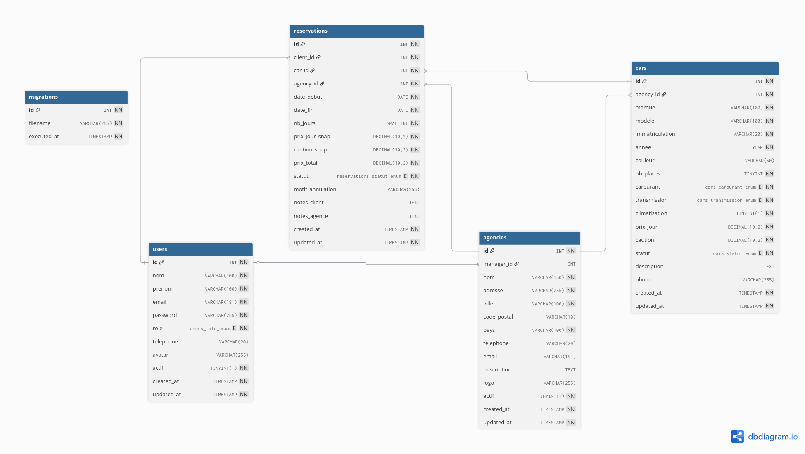


| Table | Description |
|---|---|
| `users` | Comptes (client, agency_manager, super_manager) |
| `agencies` | Agences avec manager assigné |
| `cars` | Véhicules rattachés à une agence |
| `reservations` | Réservations avec workflow de statuts |
| `migrations` | Suivi des migrations exécutées |

---

## 🔑 Comptes de démonstration

Après `php database/migrate.php --fresh --seed`, ces comptes sont disponibles
(mot de passe pour tous : **`user1234`**) :

| Rôle | Email | Accès |
|---|---|---|
| Super Manager | `admin@carrental.ma` | `/admin/dashboard` |
| Manager Agence | `youssef.benali@carrental.ma` | `/manager/dashboard` |
| Client | `sara.idrissi@gmail.com` | `/dashboard` |

---

## 👤 Rôles et permissions

| Fonctionnalité | Client | Manager Agence | Super Manager |
|---|:---:|:---:|:---:|
| Parcourir / réserver des voitures | ✅ | ❌ | ✅ |
| Gérer ses réservations | ✅ | — | ✅ |
| Gérer les voitures de son agence | ❌ | ✅ | ✅ |
| Confirmer / refuser des réservations | ❌ | ✅ | ✅ |
| Modifier son agence | ❌ | ✅ (limité) | ✅ (complet) |
| Créer / supprimer des agences | ❌ | ❌ | ✅ |
| Gérer tous les utilisateurs | ❌ | ❌ | ✅ |
| Voir toutes les statistiques | ❌ | ✅ (son agence) | ✅ (global) |

---

## 🛣 Routes principales

<details>
<summary><strong>Voir toutes les routes</strong></summary>

#### Public
```
GET  /                          Accueil
GET  /cars                      Catalogue voitures
GET  /cars/{id}                 Fiche voiture
GET  /agences                   Liste des agences
GET  /contact                   Formulaire de contact
POST /contact                   Envoi du message
GET  /login                     Connexion
POST /login
GET  /register                  Inscription
POST /register
```

#### Client (authentifié)
```
GET  /dashboard                 Tableau de bord
GET  /reservations               Mes réservations
GET  /reservations/new           Nouvelle réservation
POST /reservations
POST /reservations/{id}/cancel
GET  /profile                    Mon profil
```

#### Manager d'agence
```
GET  /manager/dashboard
GET  /manager/cars                       Mes voitures
POST /manager/cars
GET  /manager/cars/{id}/edit
POST /manager/cars/{id}
POST /manager/cars/{id}/statut
GET  /manager/reservations               Réservations de l'agence
POST /manager/reservations/{id}/confirm
POST /manager/reservations/{id}/refuse
GET  /manager/agency                     Mon agence
```

#### Super Manager
```
GET  /admin/dashboard
GET  /admin/users                        Gestion utilisateurs
GET  /admin/agencies                     Gestion agences
GET  /admin/agencies/{id}/edit
POST /admin/agencies/{id}
GET  /admin/cars                         Toutes les voitures
GET  /admin/reservations                 Toutes les réservations
```

</details>

---

## 📸 Captures d'écran

### 🌐 Pages publiques

| Accueil — Hero | Voitures populaires |
|---|---|
|  | 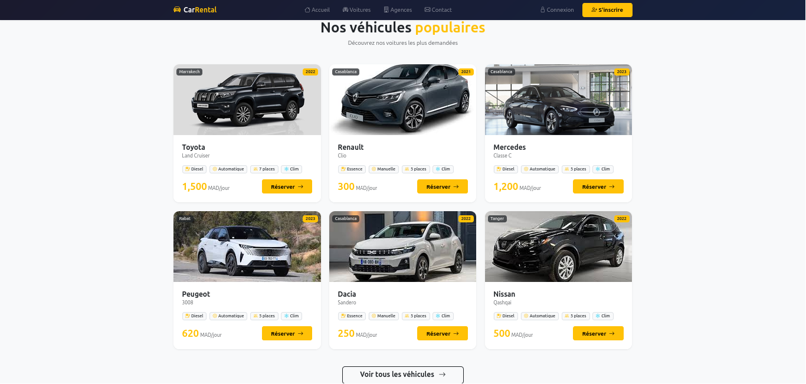 |

| Catalogue avec filtres | Fiche détail voiture |
|---|---|
|  | 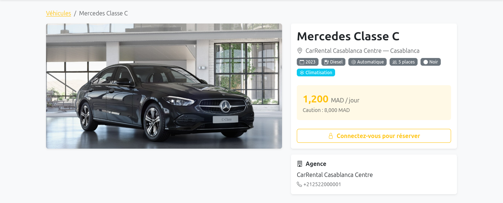 |

| Nos agences | Page contact |
|---|---|
| 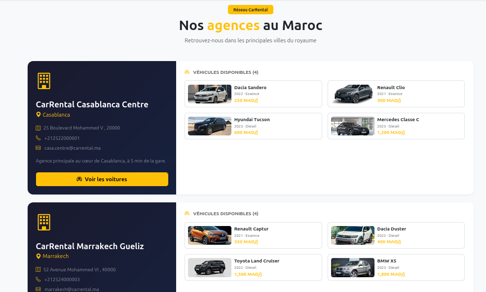 | 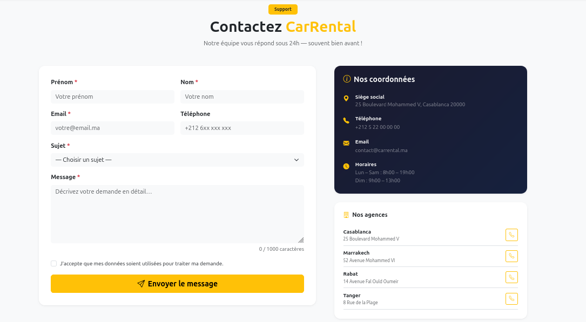 |

---

### 🔐 Authentification

| Connexion | Inscription |
|---|---|
| 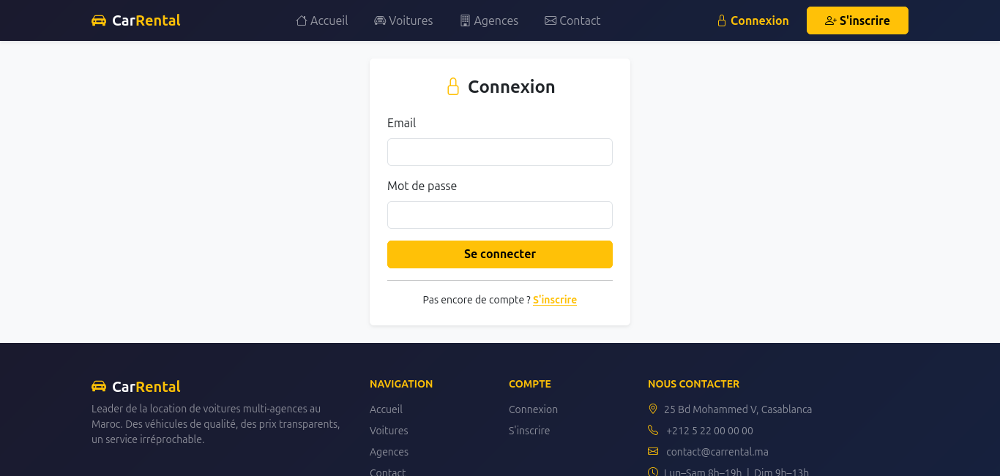 | 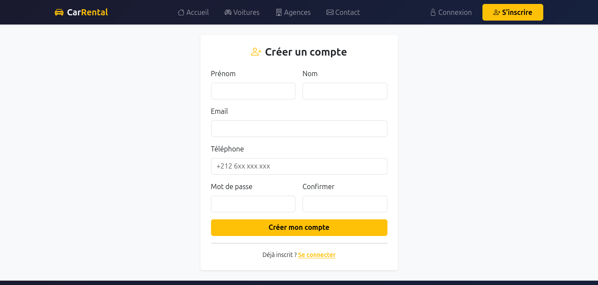 |

---

### 👤 Espace Client

| Dashboard | Mes réservations |
|---|---|
| 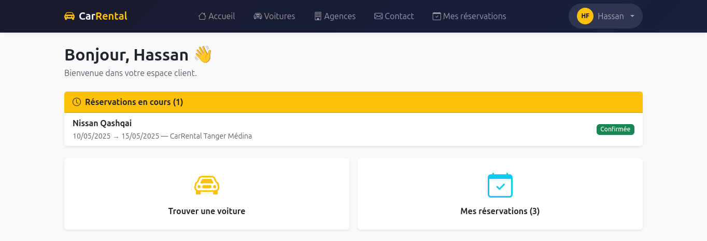 | 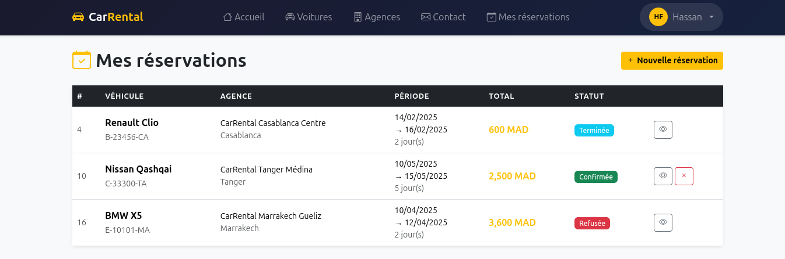 |

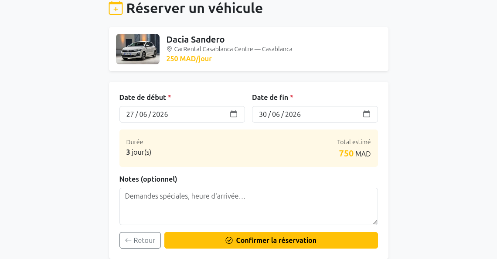

---

### 🏢 Espace Manager

| Dashboard manager | Mes voitures |
|---|---|
| 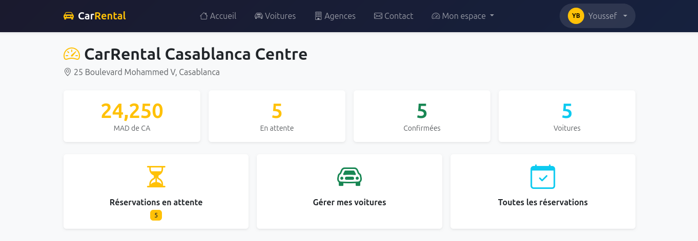 | 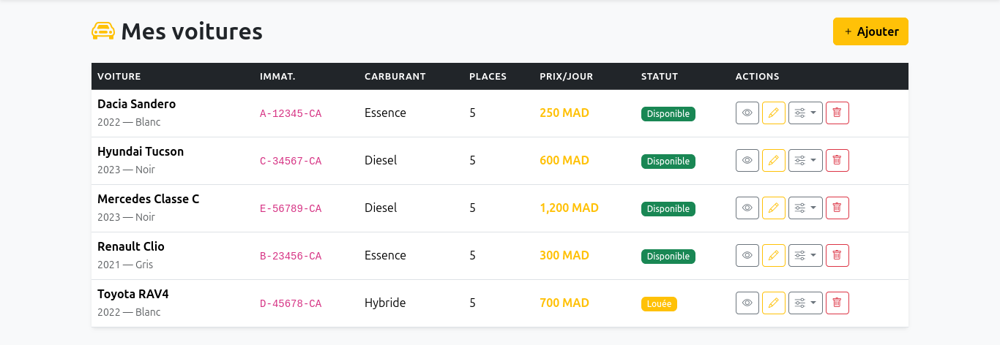 |

| Ajout voiture | Réservations agence |
|---|---|
| 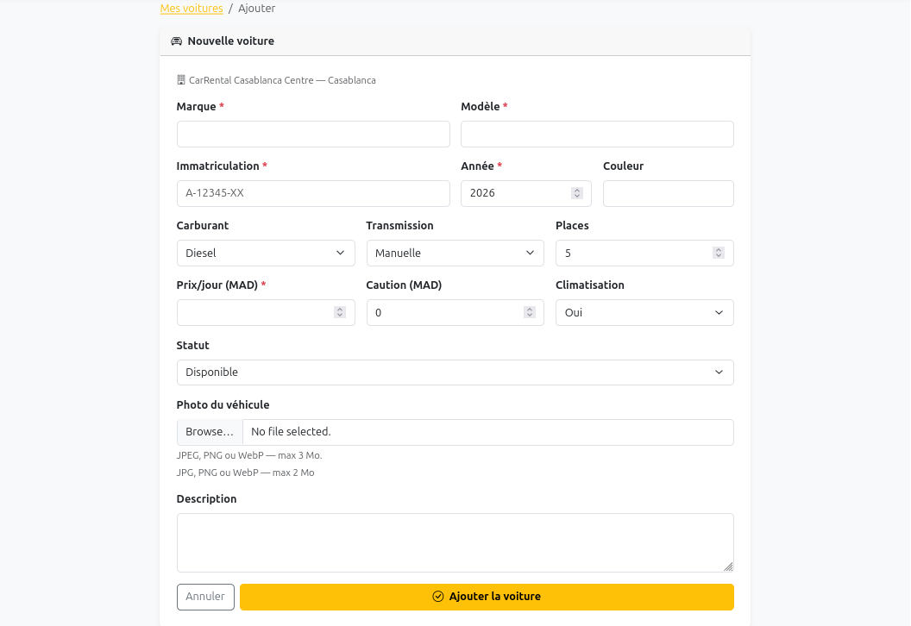 | 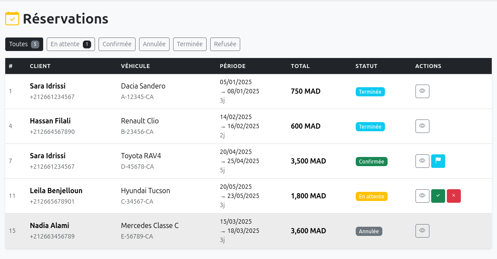 |

---

### 🛡 Espace Super Manager

| Dashboard admin | Utilisateurs |
|---|---|
| 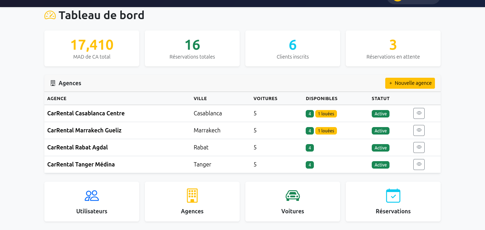 | 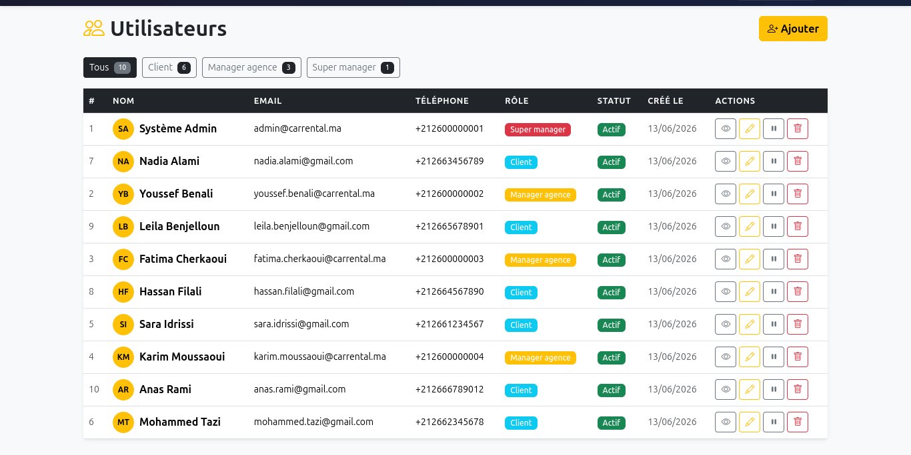 |

| Agences | Modifier une agence |
|---|---|
| 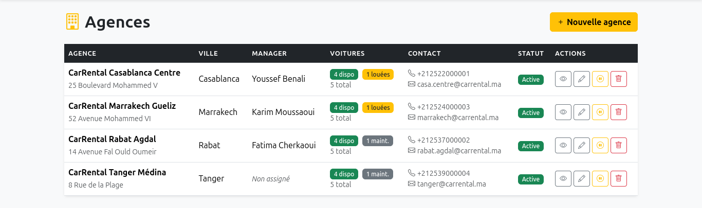 | 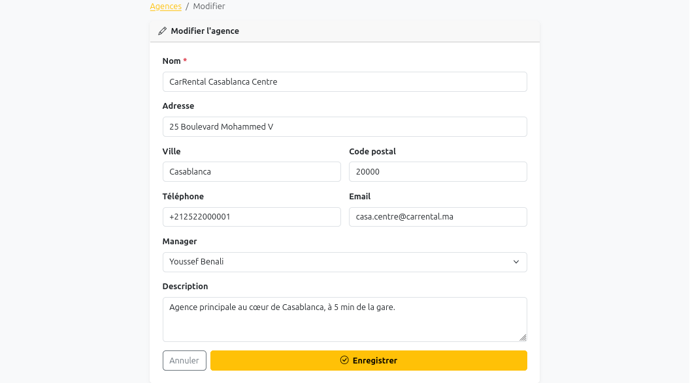 |

---